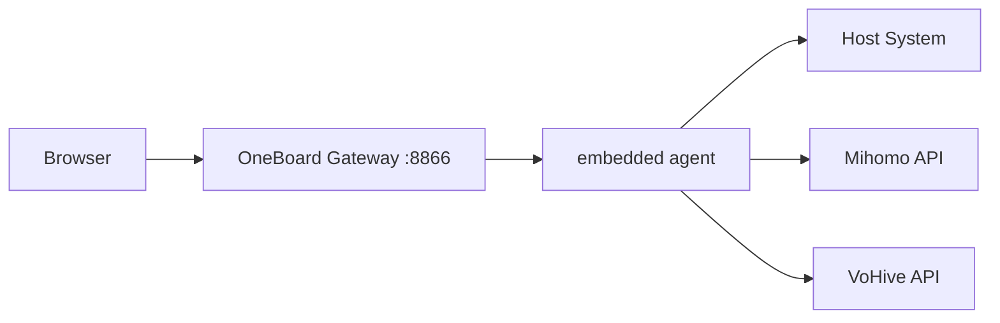

# OneBoard V1.1

OneBoard is a host-aware control plane for Mihomo, VoHive, and host runtime telemetry.

**Production deployment: Docker only.** Devices (NAS / ARM / 飞牛) do not need Node.js or local `npm build`.

## Quick Start (Docker — recommended)

On the target device (amd64 / arm64 / armv7):

```bash
docker compose pull
docker compose up -d
```

Default image: `ghcr.io/oneboard/oneboard:1.1` (override with `ONEBOARD_IMAGE` in `.env`).

Access: `http://<host-ip>:8866`

Verify:

```bash
curl http://127.0.0.1:8866/api/health
```

### Volumes (data only)

Production compose mounts **only**:

| Mount | Purpose |
|-------|---------|
| `onebord-data` → `/app/.onebord` | App data / user DB |
| `/proc` → `/host/proc:ro` | Host CPU/memory metrics |
| `/` → `/host/root:ro` | Host disk metrics |

Do **not** mount `src/`, `dist/`, or `node_modules/` into the container.

### 飞牛 NAS / docker.fnnas.com 401

If pulling **`node:22-alpine`** (or any base image) from `docker.fnnas.com` returns **401 Unauthorized**, **do not build on the device**. That registry mirror often blocks upstream base layers.

Use the **pre-built multi-arch image** from GHCR instead:

```bash
# .env
ONEBOARD_IMAGE=ghcr.io/<your-org>/oneboard:1.1

docker compose pull
docker compose up -d
```

CI builds `linux/amd64`, `linux/arm64`, and **`linux/arm/v7`** — ARMv7 is fully supported.

### Local build (maintainers only)

Requires Docker on a build machine (not on ARM NAS):

```bash
docker compose -f docker-compose.build.yml build
docker compose -f docker-compose.build.yml up -d
```

Multi-arch publish is handled by GitHub Actions: [`.github/workflows/docker-image.yml`](.github/workflows/docker-image.yml).

### Base image note

Images use **`node:22-bookworm-slim`** (Debian/glibc) instead of Alpine/musl for better compatibility on ARM and armv7, especially with native Node addons.

## Architecture



## Runtime Endpoints

- `GET /api/health`
- `GET /api/control-plane/snapshot`
- `WS /api/control-plane/ws`
- `GET /api/system-info`
- `GET /api/version`
- `/mihomo/*` proxy
- `/vohive/*` proxy

## Local Development

Requires Node.js on your **dev machine** only:

```bash
npm install
npm run dev
```

Production-style local run:

```bash
npm run build
ONEBORD_RUNTIME=docker ONEBORD_PORT=8866 npm start
```

See [release/docker/README.md](release/docker/README.md) for release bundle details.
